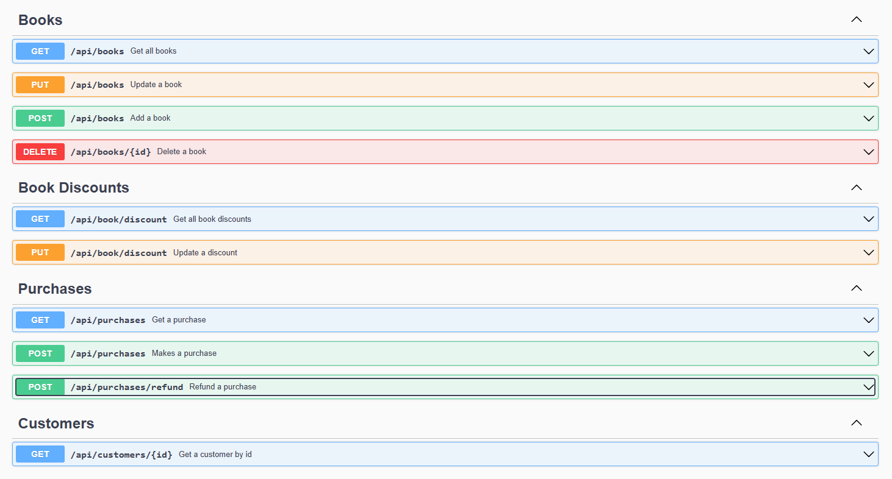

# roberts-book-store

# Robert's Book Store

Robert's Book Store is an application designed to manage a bookstore's inventory, sales, and customer interactions. This
project aims to provide an efficient and user-friendly way to handle book-related operations and streamline the
management process.

## Features

- **Inventory Management**
    - Add, remove, and update books in the inventory.
  - Track stock levels and information about each book such as title, author, quantity, category and price.
  - View and maintain Book discount categories

- **Sales Tracking**
    - Handle purchase transactions.
    - Record sales data for analysis and reporting.
  - Handle refunds for orders

- **Customer Management**
    - Maintain a database of customers.
  - View and maintain loyalty points

## Technologies Used

- **Backend**: Implemented in Java 20 and Spring 2.7.10 for handling functional logic.
- **Database**: H2 local database for storing book, customer, and sales data.
- **Build Tool**: Maven.

## Getting Started

To get the application up and running, follow these steps:

1. **Clone the repository**:
   ```bash
   git clone https://github.com/robert-mcintosh/roberts-book-store
   ```
2. **Navigate to the project directory**:
   ```bash
   cd roberts-book-store
   ```
3. **Install dependencies**:
   ```bash
   mvn clean install 
   ```
4. **Setup the database**:
    - The database is setup and pre-populated via the sql resources
    - -> src/main/resources/schema.sql
    - -> src/main/resources/data.sql


5. **Run the application**:
   ```bash
   mvn spring-boot:run 
   ```

6. **Open in browser**:
   Access the application at `http://localhost:8080/swagger-ui/index.html`

   

## Usage

Once the application is running, users can interact with it to:

- Browse and maintain books in the inventory.
- View and modify the book types/categories that determine the discounts
- View the customer information
- Purchase books, view purchase orders, and refunds

Assumptions made along the way:

- The discount is applied on the cart size - not the quantity if any particular type
- Loyalty points cannot be used immediately, i.e. they get redeemed before the latest order accrues it's points
- Adding or removing of Book Discount categories will remain manual via SQL

Not catered for:

- Purchasing multiple of the same book in one transaction

## Contributing

Contributions are welcome! To contribute:

1. Fork the repository.
2. Create a new branch for your feature or bug fix:
   ```bash
   git checkout -b feature/your-feature-name
   ```
3. Commit your changes:
   ```bash
   git commit -m "Add your message here"
   ```
4. Push to your branch:
   ```bash
   git push origin feature/your-feature-name
   ```
5. Open a pull request.

## License

This project is licensed under the [Specify License, e.g., MIT License]. See the `LICENSE` file for more details.

## Contact

For questions or support, you can contact r.mcintosh@rocketmail.com.

---